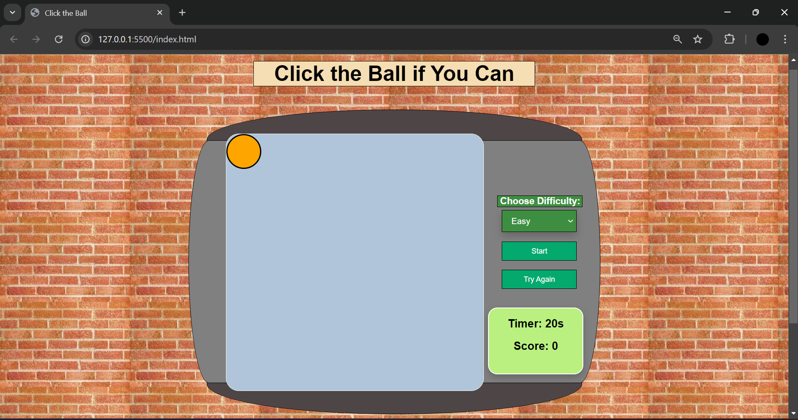

# This is my game

## **_"Click the ball"_**

### Game Screenshot



### Pseudocode:-

1. Define the variables used to track the state of the game:

- score = 0 track how many time the ball is clicked
- gameTime = 30 s game time duration in seconds

2. Define the required constants:

- get the start button element from the HTML and store it in a const
- define the ball in HTML and design it in CSS and then store it in const
- define the game area in HTML and design it in CSS and store it in const
- get the score display element from the HTML and store it in a const
- get the time display element from the HTML and store it in a const

3. function to start the game

- score will be 0
- set the game time to 20 s
- time display use textContent

7. handle the count down function

- end the game after time finish and show a message to user with his score

5. Handle a player clicking the random ball

- make a function with event listener that count the score by clicking the ball in this function the count score will display using textContent

6. Handle generating random ball function in game area

- define the game area
- define the ball
- find a way to set the ball in a random position

7. lose condition

- if the user did not catch any ball during the time he lose.

8. The ball will be designed in the css (set the width, height etc..) as will as all the elements in the HTML

### Reference

1. **_HTML_** form W3school in this part of the project only

```HTMl
<select id="difficulty">
        <option value="easy">Easy</option>
        <option value="medium">Medium</option>
        <option value="hard">Hard</option>
      </select>
```

more information [W3school](https://www.w3schools.com/tags/tag_select.asp)

2. For the **_CSS_** also i use W3school i also use css tricks

   - [W3school](https://www.w3schools.com/css/default.asp)
   - [CSS-tricks](https://css-tricks.com/the-shapes-of-css/)

3. for **_JS_** it was so helpful to use W3school resources
   more info [W3school](https://www.w3schools.com/jsref/met_win_setinterval.asp)
   > help me a lot with this method `setInterval()`

- This site inspired me to write my move element code  
  [stackoverflow](https://stackoverflow.com/questions/55086016/how-do-you-get-an-html-element-to-move-to-a-random-spot-using-javascript)

**_My code_**

```javascript
const ballMove = () => {
  const gameAreaWidth = gameAreaEl.clientWidth
  const gameAreaHeight = gameAreaEl.clientHeight

  const randomX = Math.floor(
    Math.random() * (gameAreaWidth - ballEl.clientWidth)
  )
  const randomY = Math.floor(
    Math.random() * (gameAreaHeight - ballEl.clientHeight)
  )

  ballEl.style.left = `${randomX}px`
  ballEl.style.top = `${randomY}px`
}
```
